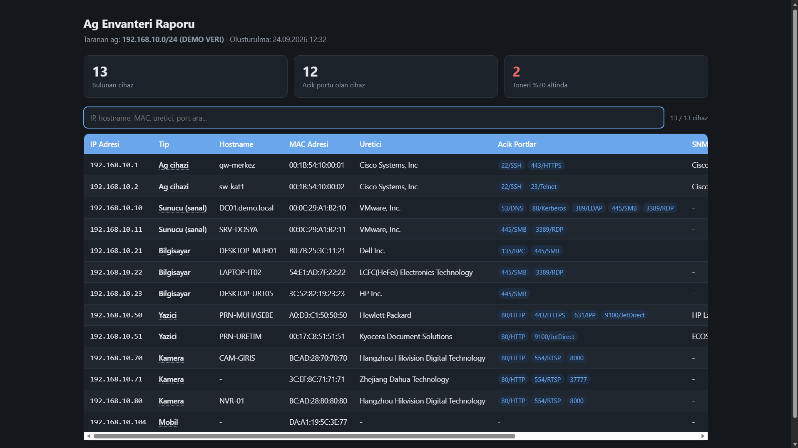
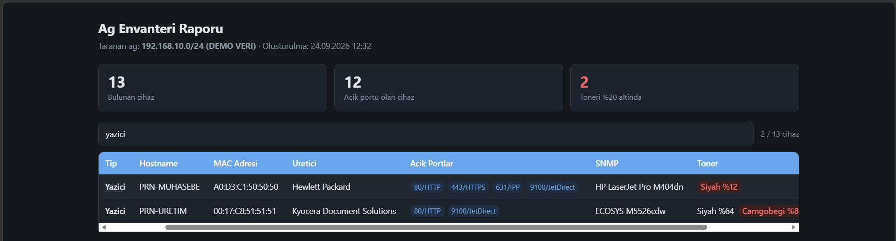
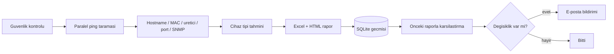

# Ağ Envanteri Aracı

Yerel ağdaki cihazları otomatik olarak keşfeden, tanımlayan ve zaman içindeki değişiklikleri takip eden bir Python aracı. Tek komutla ağı tarar; her cihazın IP, MAC, üretici, açık port ve SNMP bilgilerini toplar, cihaz tipini tahmin eder, Excel ve etkileşimli HTML rapor üretir, geçmişi veritabanında saklar ve önemli bir değişiklik olduğunda e-posta ile bildirir.

Bilgisayar Programcılığı stajı sürecinde geliştirilmiştir.



*Ekran görüntüleri tamamen uydurma demo verisiyle oluşturulmuştur.*

## Özellikler

- **Paralel ağ taraması:** Bir alt ağdaki tüm adresleri eş zamanlı ping ile tarar.
- **Cihaz bilgisi toplama:** Ters DNS ile hostname, ARP tablosundan MAC adresi, OUI veritabanından üretici, TCP ile açık portlar.
- **SNMP desteği:** Cihaz kimliği ve yazıcılarda toner/sarf malzeme seviyeleri.
- **Cihaz tipi tahmini:** Açık portlar, üretici, hostname kalıpları, SNMP açıklaması ve MAC özelliklerine bakarak kural tabanlı sınıflandırma (yazıcı, kamera, sunucu, ağ cihazı, bilgisayar, mobil, IoT). Her tahmin güven seviyesi ve gerekçesiyle birlikte verilir; sanal makineler ayrıca işaretlenir.
- **Excel ve HTML rapor:** Biçimlendirilmiş Excel dosyası ve tarayıcıda açılan, aranabilir ve sıralanabilir tek dosyalık HTML rapor. Harici kütüphane veya internet bağlantısı gerektirmez.
- **Değişiklik tespiti:** Her tarama bir öncekiyle karşılaştırılır. Eşleştirme MAC adresine göre yapıldığından, DHCP ile IP adresi değişen bir cihaz "kaybolan + yeni" yerine "değişen" olarak raporlanır.
- **Tarama geçmişi:** SQLite veritabanında her cihazın ilk/son görülme zamanı, kullandığı IP adresleri ve bir IP'yi zaman içinde hangi cihazların kullandığı sorgulanabilir.
- **E-posta bildirimi:** Yeni, erişilemeyen veya değişen cihaz ve düşük toner durumunda otomatik bildirim. Değişiklik yoksa e-posta gönderilmez.
- **Zamanlanmış çalıştırma:** Windows Görev Zamanlayıcı ile belirli saatlerde otomatik tarama.
- **Tarama güvenlik kilidi:** Yasaklı ağlarla çakışan veya bilgisayarın doğrudan bağlı olmadığı aralıkların taranmasını engeller.



## Nasıl çalışır



## Kurulum

Python 3.12 veya üzeri gerekir. Windows 10/11 üzerinde geliştirilip test edilmiştir.

```
git clone https://github.com/MusaYurdakul/ag-envanteri.git
cd ag-envanteri
python -m venv venv
venv\Scripts\activate
pip install -r requirements.txt
copy config.ornek.ini config.ini
```

Ardından `config.ini` dosyasını kendi ağınıza göre düzenleyin.

> **Not:** `pysnmp` kütüphanesinin yeni sürümlerinde API değiştiği için proje `pysnmp-lextudio==5.0.34` ve `pyasn1<0.5.0` sürümlerini kullanır. `requirements.txt` bunları sabitler.

## Yapılandırma

Tüm ayarlar `config.ini` dosyasındadır: varsayılan tarama aralığı, iş parçacığı sayısı, taranacak portlar, SNMP community, toner eşiği, çıktı klasörü, e-posta ve güvenlik ayarları.

E-posta parolası güvenlik gereği dosyada tutulmaz, `ENVANTER_SMTP_SIFRE` ortam değişkeninden okunur. Gmail için normal parola değil, [uygulama şifresi](https://myaccount.google.com/apppasswords) gerekir.

```powershell
$s = Read-Host "Uygulama sifresi"
[Environment]::SetEnvironmentVariable("ENVANTER_SMTP_SIFRE", $s, "User")
```

`[eposta]` bölümündeki `deneme_modu = true` iken e-posta gönderilmez, içerik `loglar/son_bildirim.txt` dosyasına yazılır.

## Kullanım

```
python main.py                          # config.ini'deki agi tarar
python main.py 192.168.1.0/24           # belirtilen agi tarar
python main.py 192.168.1.0/24 --snmp-yok --port-tarama-yok   # hizli tarama

python karsilastir.py eski.xlsx yeni.xlsx   # iki raporu karsilastirir, fark raporu uretir

python veritabani.py                    # tarama gecmisi ozeti
python veritabani.py --cihaz 192.168.1.40         # bu IP'yi kullanan cihazlar
python veritabani.py --cihaz AA:BB:CC:DD:EE:FF    # bu cihazin gecmisi
python veritabani.py --ice-aktar "raporlar/envanter_*.xlsx"   # eski raporlari ice aktarir

python guvenlik.py 192.168.1.0/24       # bu aralik taranabilir mi?
python demo.py                          # ornek veriyle demo HTML rapor
```

Raporlar `raporlar/`, günlük kayıtları `loglar/` klasörüne yazılır.

### Zamanlanmış çalıştırma

`envanter_calistir.bat` içindeki tarama aralığını düzenleyin, ardından PowerShell'de:

```powershell
$eylem = New-ScheduledTaskAction -Execute "$PWD\envanter_calistir.bat" -WorkingDirectory "$PWD"
$tetik = New-ScheduledTaskTrigger -Daily -At 20:00
$ayar  = New-ScheduledTaskSettingsSet -AllowStartIfOnBatteries -DontStopIfGoingOnBatteries -ExecutionTimeLimit (New-TimeSpan -Minutes 30)
Register-ScheduledTask -TaskName "AgEnvanteri" -Action $eylem -Trigger $tetik -Settings $ayar
```

## Güvenlik ve etik kullanım

Bu araç aktif ağ taraması yapar. **Yalnızca sahibi olduğunuz veya taramak için açık izniniz bulunan ağlarda kullanın.** Kurumsal ağlarda izinsiz tarama, güvenlik sistemlerini tetikleyebilir ve kurum politikalarını ihlal edebilir.

Araç bu riski azaltmak için tarama öncesinde iki kontrol yapar:

1. Hedef aralık, `config.ini` içindeki `[guvenlik] yasak_aglar` listesiyle çakışıyorsa tarama başlamaz.
2. Hedef aralık, bilgisayarın o anda doğrudan bağlı olduğu bir ağ değilse tarama başlamaz. Böylece örneğin farklı bir ağ için hazırlanmış zamanlanmış görev, yanlış yerde tetiklendiğinde paket göndermez.

## Testler

Testler ağ taraması yapmaz; sahte verilerle çalışır.

```
python test_karsilastir.py    # MAC tabanli karsilastirma (8 senaryo)
python test_veritabani.py     # tarama gecmisi (10 senaryo)
python test_cihaz_tipi.py     # cihaz tipi tahmini (10 senaryo)
python test_guvenlik.py       # tarama guvenlik kilidi (9 senaryo)
```

## Proje yapısı

| Dosya | Görevi |
|---|---|
| `main.py` | Giriş noktası; tüm adımları sırayla çalıştırır |
| `ayarlar.py` | `config.ini` okuma |
| `gunluk.py` | Dosyaya ve ekrana günlük kaydı |
| `guvenlik.py` | Tarama öncesi ağ güvenlik kontrolü |
| `tarayici.py` | Paralel ping taraması |
| `cihazbilgi.py` | Hostname, ARP/MAC, üretici, port bilgisi |
| `snmp_bilgi.py` | SNMP sorguları, toner seviyeleri |
| `cihaz_tipi.py` | Kural tabanlı cihaz tipi tahmini |
| `rapor.py` | Excel rapor |
| `html_rapor.py` | Etkileşimli HTML rapor |
| `karsilastir.py` | MAC tabanlı rapor karşılaştırma |
| `veritabani.py` | SQLite tarama geçmişi ve sorgular |
| `bildirim.py` | E-posta bildirimi |
| `demo.py` | Demo rapor üretimi |
| `envanter_calistir.bat` | Zamanlanmış görev için başlatıcı |

## Bilinen sınırlamalar

- MAC adresi yalnızca aynı alt ağdaki cihazlar için ARP tablosundan alınabilir; router arkasındaki cihazlar IP ile takip edilir.
- Cihaz tipi tahmini sezgiseldir; açık portu ve tanınan üreticisi olmayan cihazlar "Bilinmiyor" olarak işaretlenir. Tahmin, `config.ini`'de taranan port listesi genişletildikçe iyileşir.
- SNMP sorguları v2c ve community tabanlıdır.
- Aynı dakika içinde iki tarama yapılırsa rapor dosya adları çakışır.

## Lisans

Copyright (c) 2026 Musa Sefa Yurdakul. Tüm hakları saklıdır.

Bu depodaki kod yalnızca incelenmek üzere yayınlanmıştır. Yazılı izin olmadan kopyalanamaz, değiştirilemez, dağıtılamaz veya ticari amaçla kullanılamaz. Ayrıntılar için [LICENSE](LICENSE) dosyasına bakın.